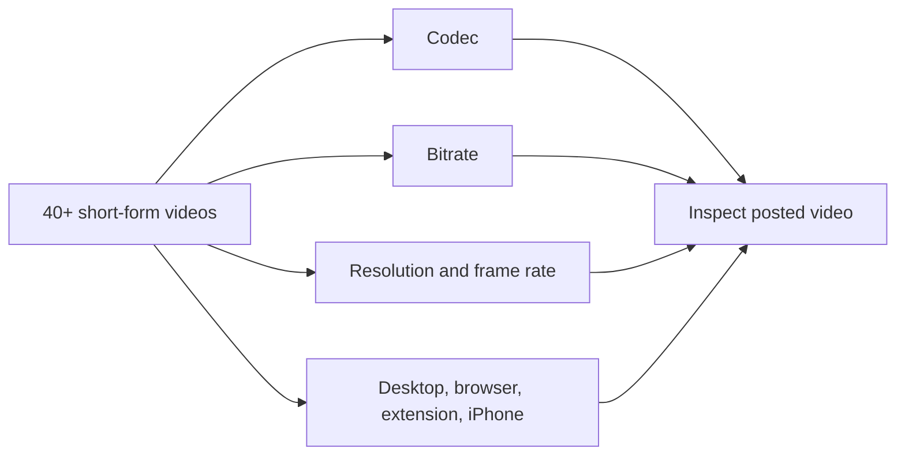
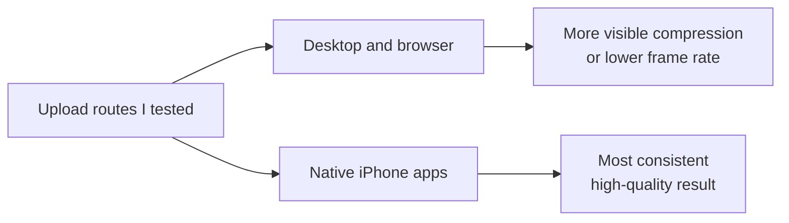

# 4K60 Native Ingest: findings from 40+ video tests

**28 September 2026**

## Summary

I tested more than 40 short-form videos across YouTube, TikTok, Instagram, Threads, Facebook, and X. I varied codecs, bitrates, resolutions, frame rates, and upload methods. I also built and tried a 60 fps Chrome upload extension. My most consistent high-quality result was a genuine vertical 4K/60 fps export uploaded from an iPhone through the native app.

The desktop and browser paths I tried more often produced visible compression or lower-frame-rate playback. Changing export settings and using the extension did not make those paths as consistent as the iPhone path in my testing.

## What I tested

I judged the posted video, not just the export file or the upload preview. A source marked 60 fps does not prove that the platform serves 60 fps. [YouTube also processes higher-quality versions after the initial upload](https://support.google.com/youtube/answer/71674?hl=en-GB), so I checked after processing.

## Result

This is the result of my internal testing, not a claim that every iPhone upload is delivered in 4K/60 or that every desktop upload fails. The Chrome extension could change the browser upload flow, but it did not change my overall result.

## Why the phone may perform better

My working explanation is that the iPhone's native media path prepares 4K/60 footage efficiently before upload. Apple provides [on-device media export](https://developer.apple.com/documentation/avfoundation/avassetexportsession?language=objc) and [hardware-assisted video encoding](https://developer.apple.com/documentation/videotoolbox?language=objc). I have not measured what each social app sends to its server, so the exact cause remains open. The practical difference in my tests was the upload route.

## Recommendation

When the footage supports it, I export a genuine **2160 × 3840, 59.94/60 fps progressive** file, select that exact file on the iPhone, upload through the native app, and check the finished post after processing. Raising bitrate, upscaling, or forcing a 60 fps label cannot replace real source detail or a good delivery path.
