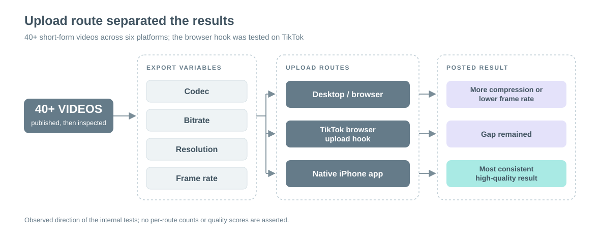
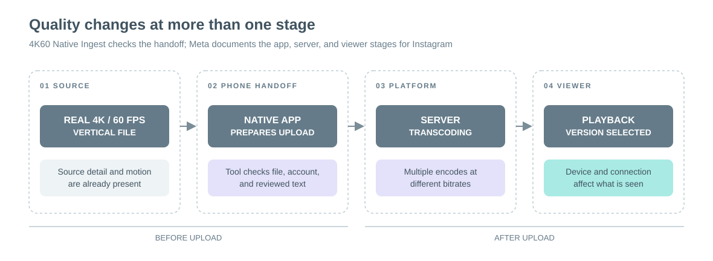
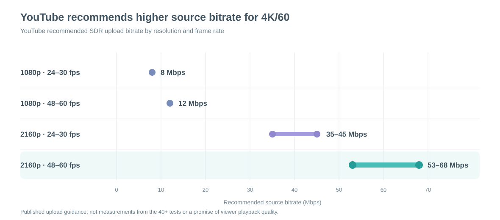

# 4K60 Native Ingest: findings from 40+ video tests

**28 September 2026**

## Summary

I tested more than 40 short-form videos across YouTube, TikTok, Instagram, Threads, Facebook, and X. I varied codecs, bitrates, resolutions, frame rates, and upload methods. I also built a Chrome extension to test whether TikTok's web upload path could retain 60 fps. My most consistent high-quality result was a genuine vertical 4K/60 fps export uploaded from an iPhone through the native app.

The desktop and browser paths I tried more often produced visible compression or lower-frame-rate playback. Changing export settings and using the extension did not make those paths as consistent as the iPhone path in my testing.

## What I tested

*Figure 1. Structure and qualitative result of my 40+ video tests. No per-route counts or quality scores are inferred.*

I judged the posted video, not just the export file or the upload preview. A source marked 60 fps does not prove that the platform serves 60 fps. [YouTube also processes higher-quality versions after the initial upload](https://support.google.com/youtube/answer/71674?hl=en-GB), so I checked after processing.

## What I tried with a Chrome extension

I wanted TikTok's website on Windows to publish 60 fps video the way its iPhone app did in my tests. If that worked, I could skip moving each video to the phone. I inspected a supplied Chrome extension called **60FPS Upload Manager v5.5.2** to see how it tried to change TikTok uploads.

The supplied extension had two approaches:

- **Basic mode** ran inside TikTok's upload page. It swapped a temporary URL the page used for the selected video and removed draft and canvas-editing settings from the upload request. The aim was to make TikTok handle the browser upload differently. It did not make a new 60 fps file or force TikTok to publish at 60 fps.
- **Cloud and enhanced modes** sent the file to a third-party service and used Telegram-linked login. I wanted a local path without sending my video to that service, so I did not build those modes.

My first helper only checked the source video's frame rate and opened upload pages for Instagram, YouTube, and TikTok. I then built a TikTok-only version of the reference extension's basic mode. I still selected and posted the file through TikTok's normal uploader. Its green check meant the page changes were active, not that the published video was 60 fps.

The TikTok web uploads I inspected were served at 30 fps, including one from a 1080p/60 fps source. A separate iPhone upload had a 1080p version near 60 fps. Rebuilding the local mode did not reproduce the iPhone result. I built 4K60 Native Ingest around the phone upload route.

## Why the upload path matters

*Figure 2. The tool checks the handoff to the native app. [Meta documents](https://engineering.fb.com/2025/11/17/ios/enhancing-hdr-on-instagram-for-ios-with-dolby-vision/) the client, server, and viewer stages for Instagram.*

The iPhone has a local video pipeline. [Apple's AVFoundation documentation](https://developer.apple.com/videos/play/wwdc2020/10010/) describes on-device export that changes codec, size, color space, and frame rate, with hardware HEVC encoding on iOS. Apple also documents [format conversion when an app shares captured video through the system share sheet](https://developer.apple.com/documentation/avfoundation/recording-movies-in-alternative-formats). The source file alone does not describe every transformation in an app upload.

[Meta describes Instagram's actual app pipeline](https://engineering.fb.com/2025/11/17/ios/enhancing-hdr-on-instagram-for-ios-with-dolby-vision/): the creator's device makes an upload file, Meta's servers transcode it, and the viewer's device selects a playback version. For iPhone HDR video, the first stage encodes HEVC on the device. This establishes local processing in a major native app. My tests measured the final result of the whole path, not the contribution of each stage.

Meta says [Instagram produces basic and advanced encodes](https://engineering.fb.com/2022/11/04/video-engineering/instagram-video-processing-encoding-reduction/) and uses adaptive bitrate playback. Its server change increased watch time covered by advanced encodes by 33%. [Reels' advanced versions](https://engineering.fb.com/2023/02/21/video-engineering/av1-codec-facebook-instagram-reels/) also depend partly on expected watch time. The upload file alone cannot establish what each viewer sees, and a browser extension cannot control those server and playback decisions.

## Related research

- **[Učakar, Selič, and Urbas (2020)](https://www.grid.uns.ac.rs/symposium/download/2020/73.pdf).** They encoded one 1080p/25 fps source at different codecs and bitrates, then compared the files after Instagram and YouTube uploads. Both platforms changed file properties, and the authors found visible quality changes. That backs my decision to judge the published video instead of treating a high-bitrate export as the result.
- **[Lu et al. (CVPR 2024)](https://openaccess.thecvf.com/content/CVPR2024/html/Lu_KVQ_Kwai_Video_Quality_Assessment_for_Short-form_Videos_CVPR_2024_paper.html).** Their short-form dataset contains 600 uploaded videos and 3,600 processed versions across preprocessing, transcoding, and enhancement. It shows why quality has to be assessed after the full processing chain. That is how I compared my codecs, resolutions, frame rates, and upload methods.
- **[Qi et al. (2023)](https://arxiv.org/abs/2312.12317).** They studied a common delivery problem: user-generated video is already compressed before a platform transcodes it again. They found that standard quality metrics poorly predicted the perceived difference after that second compression. That supports keeping real source detail and checking the viewed result instead of optimizing only the source file's bitrate.

These studies establish the processing and measurement problem. My 40+ tests answer the route question they did not test: for my videos, the native iPhone app produced the most consistent result.

## Why I built the tool

The research explains why export settings alone did not solve this: the phone prepares an upload, the server makes new encodes, and the viewer receives one of them. My tests selected the route that worked: a genuine 4K/60 file uploaded in the native iPhone app. 4K60 Native Ingest checks the intended file, account, and text before the phone upload instead of making me repeat those steps by hand. The first implementation is Windows + iPhone + YouTube Shorts; the other platforms remain future work.

## Recommended workflow

*Figure 3. [YouTube's published SDR upload ranges](https://support.google.com/youtube/answer/1722171?hl=en). These are source-file recommendations, not measured outcomes from my tests or playback bitrates.*

1. **Start with real 4K/60 footage.** Keep the source's actual detail and motion. Upscaling or labeling a 30 fps clip as 60 fps does not create either one.
2. **Export a clean vertical master.** Use **2160 × 3840, 59.94/60 fps progressive** when the source supports it. [YouTube recommends the recorded frame rate](https://support.google.com/youtube/answer/1722171?hl=en) and lists 53–68 Mbps as its 2160p high-frame-rate SDR upload range. That is a source-file starting point, not a playback bitrate.
3. **Put the exact file on the iPhone.** Check its name, size, and preview before opening the platform app. 4K60 Native Ingest uses this handoff for YouTube Shorts.
4. **Upload in the native app.** Check the account, file, and final text in the phone composer before submitting. This is the route that won my tests.
5. **Judge the processed post.** Wait for higher-quality versions to finish, then inspect the published video on another device. [YouTube says 4K and 60 fps take longer to process](https://support.google.com/youtube/answer/71674?hl=en-GB); the first low-quality version is not the final result.
