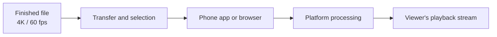
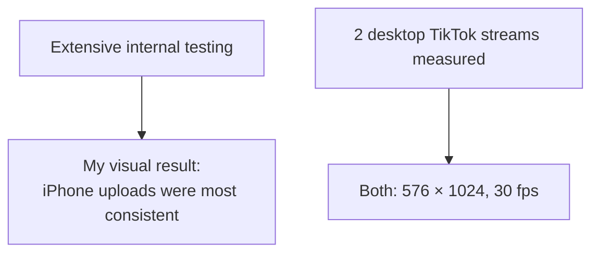
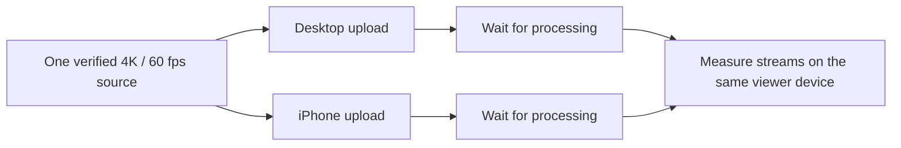

# 4K60 Native Ingest: what I found testing short-form uploads

**28 September 2026**

## Summary

In extensive internal testing, iPhone uploads of genuine 4K/60 fps vertical exports gave me the most consistent image quality on YouTube, TikTok, Instagram, Threads, Facebook, and X. I did not verify 4K/60 playback for every viewer.

Two desktop TikTok streams I measured were 576 × 1024 at 30 fps.

## Where quality can change

A 60 fps source does not tell me what viewers received. [YouTube serves lower quality first while higher resolutions finish processing](https://support.google.com/youtube/answer/71674?hl=en-GB), so an early preview is not the final result.

## What the tests show

The first result is my cross-platform observation; I did not retain matched playback measurements for every platform. The TikTok result is measured but narrower. An active browser upload hook did not make those two streams 60 fps.

I found quality and frame-rate loss. I did not measure account throttling or reach suppression.

## Why the iPhone path may help

Native apps can prepare video on the phone. Apple provides [media export](https://developer.apple.com/documentation/avfoundation/avassetexportsession?language=objc) and [hardware-assisted encoding](https://developer.apple.com/documentation/videotoolbox?language=objc). My Instagram path uses an on-phone export from Edits. Local processing may help, but I have not measured what each app sends. File selection or platform processing may also explain the difference.

[YouTube recommends uploading at the recorded frame rate](https://support.google.com/youtube/answer/1722171?hl=en). [TikTok's API accepts input up to 60 fps](https://developers.tiktok.com/docs/en/content-posting-api-media-transfer-guide). Neither statement promises 60 fps playback.

## The next comparison

The paired posts need the same source, account, visibility, settings, and playback device. After processing, I would record each stream's dimensions, frame rate, bitrate, and codec. Repeated differences would show whether the upload path matters; intermediate-file or upload-payload measurements would locate the cause.

For now, I export at **2160 × 3840, 59.94/60 progressive fps** when the footage supports it, check the file selected on the phone, and inspect the post after processing. Upscaling or invented frames do not add source detail.
