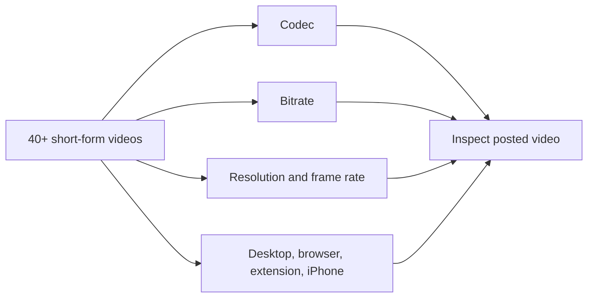
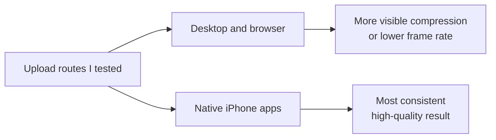

# 4K60 Native Ingest: findings from 40+ video tests

**28 September 2026**

## Summary

I tested more than 40 short-form videos across YouTube, TikTok, Instagram, Threads, Facebook, and X. I varied codecs, bitrates, resolutions, frame rates, and upload methods. I also built and tried a 60 fps Chrome upload extension. My most consistent high-quality result was a genuine vertical 4K/60 fps export uploaded from an iPhone through the native app.

The desktop and browser paths I tried more often produced visible compression or lower-frame-rate playback. Changing export settings and using the extension did not make those paths as consistent as the iPhone path in my testing.

## What I tested

I judged the posted video, not just the export file or the upload preview. A source marked 60 fps does not prove that the platform serves 60 fps. [YouTube also processes higher-quality versions after the initial upload](https://support.google.com/youtube/answer/71674?hl=en-GB), so I checked after processing.

## Result

This is the result of my internal testing, not a claim that every iPhone upload is delivered in 4K/60 or that every desktop upload fails. The Chrome extension could change the browser upload flow, but it did not change my overall result.

## Why the phone may perform better

My working explanation is that the native app prepares the video on the phone before upload. [Meta describes Instagram's client processing](https://engineering.fb.com/2025/11/17/ios/enhancing-hdr-on-instagram-for-ios-with-dolby-vision/): the creator's device makes an upload file, then Meta's servers produce playback versions. That confirms local processing in at least one of these apps. I have not measured which stage caused the difference in my own uploads.

Meta also says [Reels receives multiple encodes](https://engineering.fb.com/2023/02/21/video-engineering/av1-codec-facebook-instagram-reels/) and that advanced versions depend partly on expected watch time. The viewer's connection affects which version plays. This means the upload file alone cannot establish what people see; a browser extension cannot control those server and playback decisions.

## Related research

- [Učakar, Selič, and Urbas (2020)](https://www.grid.uns.ac.rs/symposium/download/2020/73.pdf) varied codec and bitrate, then compared video before and after Instagram and YouTube uploads. They measured changes in size, resolution, and visible quality.
- [Lu et al. (CVPR 2024)](https://openaccess.thecvf.com/content/CVPR2024/papers/Lu_KVQ_Kwai_Video_Quality_Assessment_for_Short-form_Videos_CVPR_2024_paper.pdf) studied short-form video quality using 600 uploads and 3,600 processed versions, including transcoding.
- [Qi et al. (2023)](https://arxiv.org/abs/2312.12317) studied quality loss when user-generated video is compressed again for delivery.

These papers support the processing problem. They do not test the same iPhone-versus-desktop paths I used.

## Recommendation

When the footage supports it, I export a genuine **2160 × 3840, 59.94/60 fps progressive** file, select that exact file on the iPhone, upload through the native app, and check the finished post after processing. Raising bitrate, upscaling, or forcing a 60 fps label cannot replace real source detail or a good delivery path.
