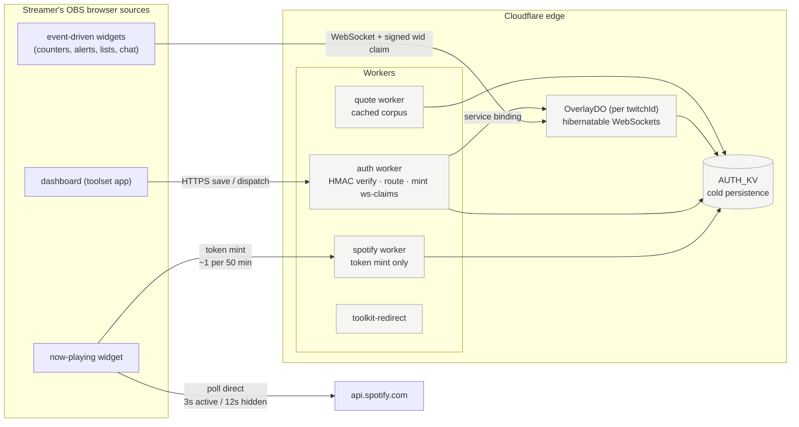
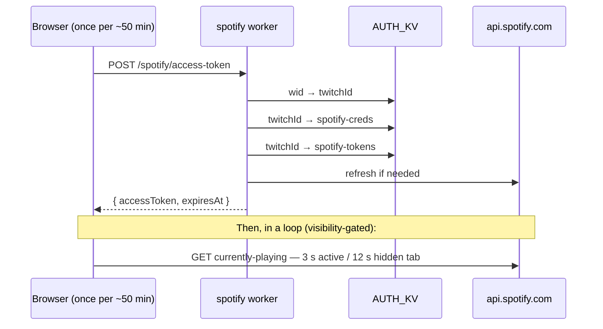
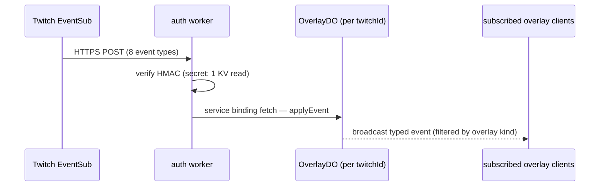
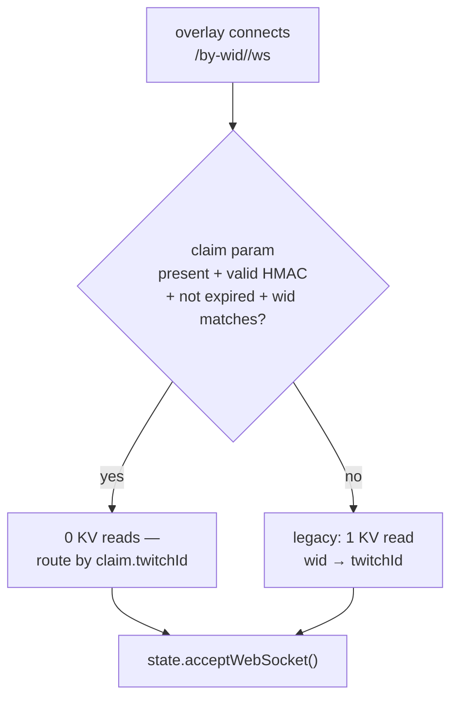
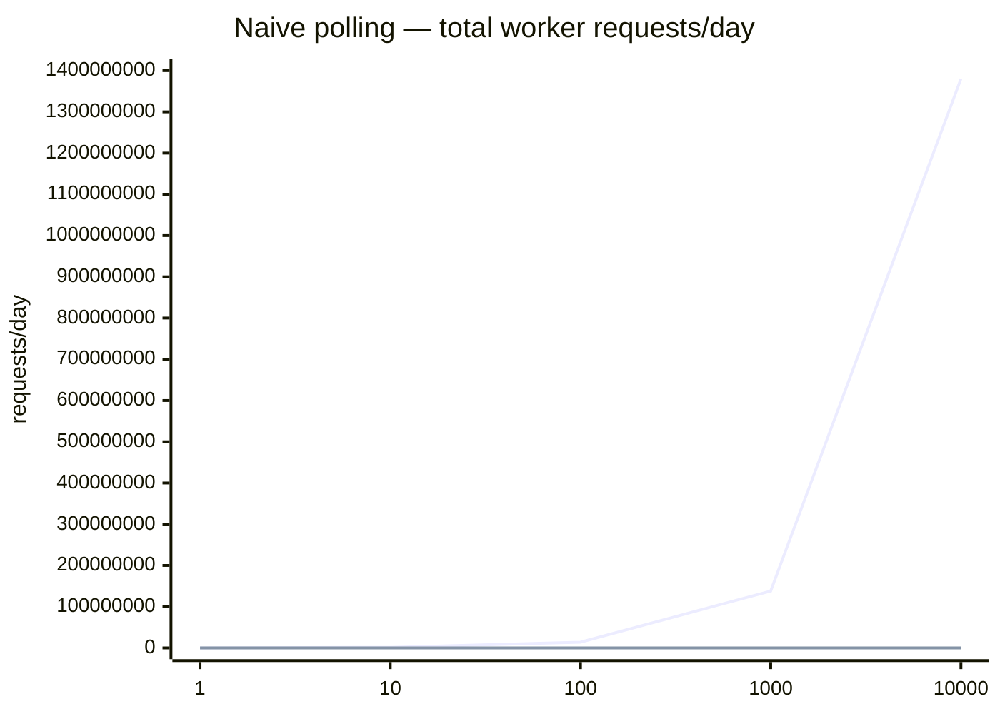
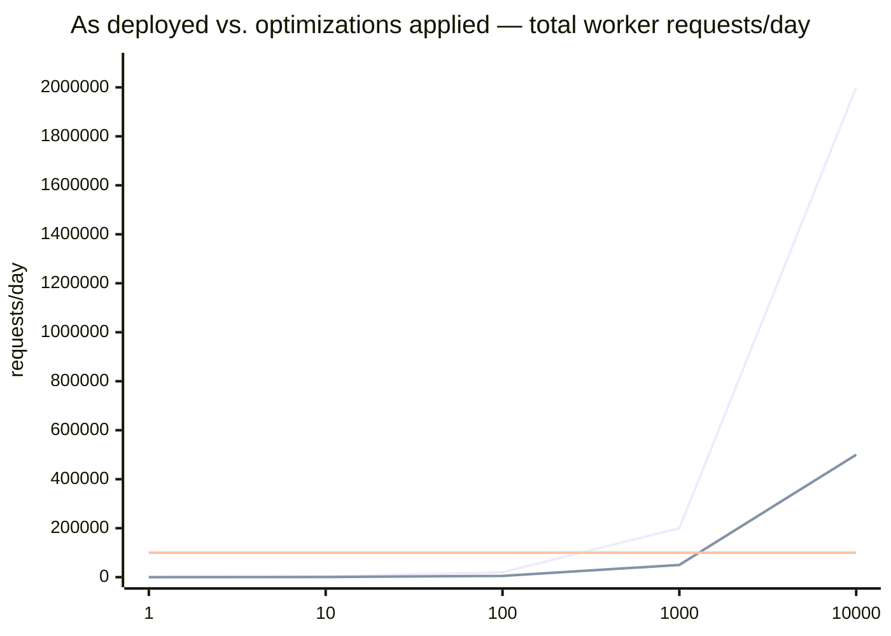

# Scaling Per-User Streaming Toolsets on Cloudflare — Edge Push, Hibernation, and Flat Cost-Per-User

**Date:** 2026-05-11 · **Updated:** 2026-09-09
**Author:** deutschmark

---

## Abstract

A per-user streaming toolset on Cloudflare's edge — Workers, KV, Durable Objects, Pages — composed so cost-per-user stays roughly flat as user count grows. Each streamer runs multiple OBS browser-source overlays; the hot path is push, not pull. The now-playing widget polls Spotify directly using a worker-minted short-lived token, eliminating server-mediated polling. The event-driven overlays subscribe to a per-user Durable Object via hibernatable WebSocket; dashboard saves and Twitch EventSub webhooks dispatch through service bindings. KV is cold persistence — read on session start and on save, never on a poll. The shape changes cost from `O(N × K × polls/hour)` to `O(N × events/hour)`, where `events ≪ polls` at any non-trivial usage. Four months of production growth — eight overlays to a 78-widget catalog, 29 active streamers — has not moved the monthly bill off a single Workers Paid umbrella.

---

## 1. Architecture

Static-export Next.js on Cloudflare Pages, five Workers (`auth`, `spotify`, `overlay-do`, `quote`, `toolkit-redirect`), one KV namespace (`AUTH_KV`). The per-user product surface is a catalog of 78 widgets — now-playing, death counter, lurk-peek, BRB player, emote rain, clip play, video shout-out, chat box, event list, task list, timers, TTS, scene builder, and variants. All real-time widgets ride the same two paths described below; the catalog grows without adding cost shape.

### 1.1 Layer A — Thin-client Spotify

The browser polls `api.spotify.com` directly. The worker's role is reduced to minting a short-lived Spotify access token on demand.

The Spotify upstream poll volume is unchanged; it moves from the worker's quota into the streamer's per-user OAuth quota where it belongs. Spotify's 30/min rate cap protects against runaway abuse downstream.

Two refinements shipped after the original measurement (§2.2): the poll interval is now adaptive — 3 s while the tab is visible, 12 s when hidden — and the poll loop is `document.visibilityState`-gated, so a forgotten OBS preview or backgrounded browser tab decays to near-zero rather than burning at full rate.

### 1.2 Layer B — Durable Object substrate with hibernatable WebSocket

A per-user Durable Object (`OverlayDO`, named by `twitchId`) holds in-memory state. Overlays open WebSocket connections via `state.acceptWebSocket()` — Cloudflare's Hibernation API keeps the connection live across DO eviction; the class methods `webSocketMessage` / `webSocketClose` deliver events without holding CPU. DO duration billing accrues only while CPU is active.

Event sources converge on the same dispatch chain:

EventSub registration covers eight event types as of 2026-09: `channel.chat.message`, `channel.follow`, `channel.raid`, `channel.update`, `channel.cheer`, `channel.subscribe`, `channel.subscription.gift`, `channel.subscription.message`. The original three (raid, follow, update) drove death-counter autofill; the additions feed the event list, TTS, and celebration widgets. Coverage grew 3 → 8 without changing the cost shape — each new event type is one more row in the dispatch table, not a new polling surface.

**Connect path (2026-09).** WebSocket connects carry a signed `wid → twitchId` claim (see §4.1, now deployed): the DO verifies an HMAC inside the same isolate instead of paying a KV read per connect/reconnect. A legacy KV-resolution fallback remains for claims minted before the migration; it is a transition path, not the steady state.

### 1.3 Layer C — KV as cold persistence

After Layers A and B, KV is touched in a small set of places: session-start config reads, user-driven save writes, EventSub-secret verification on webhook delivery, and quote-corpus reads behind an edge cache. The hot path — every poll, every event broadcast, every WebSocket reconnect under signed claims — does not touch KV.

### 1.4 `wid` as the access boundary

Overlays carry an opaque `wid` (widget token) in URL query strings; the user's `twitchId` never appears in client URLs. The signed claim of §4.1 embeds the mapping verifiably, so the DO router resolves `/by-wid/<wid>/...` with local HMAC verification (legacy path: one KV read); service-binding callers (auth, spotify worker) use the direct `/by-user/<twitchId>/...` path with no resolution step.

### 1.5 Local-first intelligence (2026-09)

The newest per-user workload is the heaviest class of all: a resident chat personality with memory — continuous LLM inference, per streamer, all stream long. The scaling decision: it does not run on the platform at all. The chat bot (ForgetMeNot) is a local runtime on the streamer's own machine; when it uses a cloud model, it does so with the streamer's own API key, and it can run entirely on a local model via Ollama with no cloud dependency. Either way the platform's marginal cost for the most expensive per-user workload is zero.

This is the flat-cost thesis applied at its limit: when a workload's cost genuinely scales per-user and cannot be amortized, the architecture answer is not a cheaper poll — it's not hosting it.

---

## 2. Cost analysis

### 2.1 Cloudflare tier shape

| Resource | Free | Workers Paid ($5/mo) |
|---|---|---|
| KV reads | 100k/day | 10M/month (~333k/day) |
| KV writes | 1k/day | 1M/month |
| Worker requests | 100k/day | 10M/month |
| DO requests | 100k/day | 1M/month + $0.15/M |
| DO duration | 13k GB-s/day | 400k GB-s/month + $12.50/M GB-s |

Workers Paid is a single umbrella: KV, Durable Objects, R2, and Workers requests are billed against one $5/mo subscription. Architectures that treat these as separate upgrades waste design budget on a fiction.

### 2.2 Now-playing path (measured)

Steady-state, single user, four-hour streaming session:

| Metric | Naive polling | Thin-client | Δ |
|---|---|---|---|
| KV reads | ~7,200 | ~20 | −99.7% |
| Worker requests | ~1,440 | ~5 | −99.65% |
| KV reads per poll | 5 | 0 | path eliminated |
| Hidden-tab 24h burn (KV reads) | ~43,200 | 0 | structurally eliminated |
| Spotify API calls per overlay-hour | ~360 | ~360 | unchanged (moved to user's OAuth quota) |

Naive baseline is 10-second polling without an edge cache. The hidden-tab elimination is the combination of two changes: a `document.visibilityState` gate on the poll loop and the structural shift that the runaway-tab path (5 KV reads × 360 polls/hour × 24 hours = 43,200) now lives entirely client-side against Spotify, not against this project's KV. The 2026-09 adaptive refinement (§1.1) improves on this further client-side: hidden tabs poll Spotify at 12 s instead of 10 s and not at all when the browser suspends the tab.

### 2.3 Event-driven paths (projected)

The event-driven overlays exchanged their polling endpoints for WebSocket subscriptions. Per-event cost on the post-migration architecture, accounted at the call-site level:

- EventSub callback verifies a per-subscription secret: 1 KV read.
- WebSocket connect/reconnect resolves `wid → twitchId`: **0 KV reads under a signed claim** (§4.1, deployed); 1 KV read only on the legacy fallback path.
- `channel.update` fan-out across `M` death-counter widget tokens: 1 (index) + M (record) KV reads and M writes, at category-change frequency — maintenance-side cost of keeping the authoritative KV copy current; the client-visible refetch storm this used to cause is eliminated by inline-state dispatch (§4.3). Rides to zero with the §4.2 cutover.
- `config-changed` broadcasts carry the new state inline (§4.3, deployed): **0 refetch reads**. Config GETs fire at page-load and fallback frequency only.

So a single `!death`-style chat event costs `1 + M + K·M` KV reads where `M` is widget-token count and `K` is connected overlays per token — down from the original accounting's `1 + 1 + M + K·M`, because the connect path no longer contributes. This is non-zero but bounded by event frequency, not polling frequency. A 4-hour streaming session with 50 chat events and one overlay per token costs ~150 KV reads on the event-driven path — versus the naive-polling projection below.

| Users | Naive (worker req/day) | Architecture as deployed |
|---|---|---|
| 1 | 138,240 | ~200 |
| 10 | 1.38M | ~2,000 |
| 100 | 13.8M | ~20,000 |
| 1,000 | 138M | ~200,000 |
| 10,000 | 1.38B | ~2M |

Naive baseline: 8 overlays × 5-second polling × 4-hour session. Per-architecture-as-deployed estimates assume 50 chat events per session and the call-site KV cost above. These are projections, not measurements — see §4 for the architectural changes that would tighten them further.

---

## 3. Patterns

### 3.1 Cache-layer composition

Workers expose three caching surfaces with distinct scopes:

| Surface | Scope | Latency | Use |
|---|---|---|---|
| In-isolate `Map` | One isolate | ~0 ms | Per-isolate dedup of identical concurrent requests |
| `caches.default` | One data center, all isolates | ~1 ms | Per-DC response cache for identical URLs |
| KV with `cacheTtl` | All edge data centers | ~5 ms | Cross-DC cache for identical keys |

A response that crosses isolate boundaries without a `caches.default` wrap pays the full origin cost on every cross-isolate hop. The fix is small — wrap the response, set `Cache-Control`, write through `ctx.waitUntil(cache.put(...))` — and removes a class of cost invisible in development (single isolate) but real in production. The `quote` worker (2026-09: a 5,558-quote corpus served with an edge-cached read path) is this pattern applied to a read-heavy static corpus — marginal cost indistinguishable from zero.

### 3.2 Visibility gating for any polling client

A polling client without a `document.visibilityState` gate is a latent runaway. The cost-when-it-fires is roughly the day-budget burned by one forgotten browser tab. The fix is ~10 lines of React per polling site. There is no excuse to ship a poll loop without it. The support-pool dashboard poll adopted the same gate in production: it pauses entirely while hidden and re-arms on return.

The same logic does not transfer cleanly to WebSocket clients: they don't poll when hidden, but they do reconnect on transient network errors. Under the signed-claim connect path (§4.1) a flapping WebSocket costs ~0 KV reads/day per overlay; before it, the same flapping at 30 s-backoff tops cost ~2,880 KV reads/day per overlay.

### 3.3 Push over polling for event-shaped data

For data that changes on discrete events (chat commands, webhook deliveries, user actions), polling is structurally wrong. Cloudflare's Hibernation API for Durable Objects is the supported path: WebSocket connections persist across DO eviction, in-memory state hydrates lazily on first event, duration billing accrues only during active CPU. Cost shape goes from `O(polls)` to `O(events)`.

### 3.4 Static-export feature flags

Next.js bakes `NEXT_PUBLIC_*` env vars into the static bundle at build time. With `output: "export"` on Cloudflare Pages, dashboard env-var changes do nothing until the next build; non-prefixed runtime env vars are unavailable to client-side code (no Node process at request time).

The implication: a static-export Pages app has no live runtime feature flags. Every "flag" is either build-time (rebuild to flip) or moves into a config endpoint (which itself becomes a polling source). Flag-then-delete on a build-time literal is a defensible idiom for migration rollout; flag-as-permanent is anti-pattern on this stack.

### 3.5 When per-user cost can't be engineered away, don't host it

§1.5 is the pattern statement: the chat bot's LLM inference is irreducibly per-user — no cache, no push substitute, no batching across streamers. The architectural answer was to move the workload to the user's machine (local model) or the user's own account (their API key), keeping the platform's per-user marginal cost at zero for even the heaviest workload class. Not every product can do this; the point is to ask before designing the poll.

---

## 4. Optimization paths — all shipped or gated

### 4.1 Signed `wid → twitchId` claim — SHIPPED (2026-09)

The DO router originally resolved `wid` to `twitchId` via a KV read on every WebSocket connect/reconnect. Deployed now: a signed (HMAC-SHA256) claim minted by the auth worker at `/ws-claim`, verified inside the DO isolate. Claim format `<base64url(JSON{w,t,e})>.<base64url(hmac)>`, 24 h expiry, legacy KV fallback during rollout. WebSocket reconnect storms drop to zero KV cost — the largest single hidden-cost source on the event path, eliminated.

### 4.2 DO SQLite for widget config — SHIPPED staged, final cutover gated (2026-09)

Widget configuration now lives in the DO's SQLite storage, migrated in stages with KV remaining authoritative until the last step:

- **Dual-write (deployed):** every save mirrors `wid:<wid>` configs and `settings:*` blobs into the user's DO storage, fire-and-forget. The wrangler config was already SQLite-backed (`new_sqlite_classes`) — the SQL surface was simply unused until now.
- **DO-first reads (deployed):** the settings surfaces (BRB, VSO, clip-play, audio-norm) and timer state read from DO storage with KV fallback (`readMirroredFromDo`). The per-wid config GET endpoints still read KV — they fire at page-load and fallback frequency only, because coalesced broadcasts (§4.3) already removed the per-event refetch that made them hot.
- **The gate (deployed 2026-09):** the 04:00 drift cron compares DO vs KV **by value** (stable-stringified, key-order-insensitive) across a sampled user set, reporting compared / drifted / missing-in-KV per key class, with key names only in logs. Zero drift over a soak window is the evidence bar for the final step.
- **The cutover (flag exists, awaiting drift evidence):** `KV_WRITES_DISABLED=1` switches the settings surfaces to DO-only writes with cron writeback; per-wid surfaces flip last, after their GET endpoints move off KV. The channel.update fan-out's `1 + M` maintenance reads ride along with that flip — they exist to keep the KV authoritative copy current, so they can't be removed while the copy is still being written.

### 4.3 Coalesced broadcast payload — SHIPPED (2026-09)

Every `config-changed` dispatch now carries the full new state inline, wid-filtered; all nine overlay clients apply the inline state directly and refetch only as a fallback for events without it. The `channel.update` fan-out likewise dispatches per-wid inline state. The post-event `K·M` refetch storm — the cost §4.2/4.3 were named for — is eliminated.

### Surviving polling — resolved

Two dashboard-side polls remained after the overlay migration: `useSupportPool` (community-fund total) and the chat-bot health check (10 s against `localhost`). The SSE idea for the first is closed, not pending: the pool changes roughly daily, and a held-open SSE connection costs more (always-on connection, duration billing) than a visibility-gated 60 s poll that sleeps entirely while the tab is hidden. Gated interval polling is the right shape for slowly-changing data; push earns its keep only when events are frequent. The second is local-loopback only and does not consume Cloudflare quota.

---

## 5. Cost projection by user count

Assumptions: 4-hour streaming session per user per day, all overlays connected, 50 chat events per session.

| Users | Naive polling (worker req/day) | Architecture-as-deployed | With the §4.2 cutover complete |
|---|---|---|---|
| 1 | 138,240 | ~200 | ~50 |
| 10 | 1.38M | ~2,000 | ~500 |
| 100 | 13.8M | ~20,000 | ~5,000 |
| 1,000 | 138M | ~200,000 | ~50,000 |
| 10,000 | 1.38B | ~2M | ~500k |

Naive crosses the free-tier daily ceiling at one user, the paid-tier daily-equivalent at ten. Architecture-as-deployed stays in free-tier headroom through 1,000 active streamers; with the §4.2 cutover complete (KV writes dropped, all reads from DO storage), through 10,000. §4.1 and §4.3 are already reflected in the deployed column — the reconnect-path KV component and the post-event refetch storm are gone; the cutover column removes the remaining maintenance-side fan-out reads and the page-load config GET reads.

The two curves, against the tier ceilings that actually bill:

The flat lower line in each chart is the free-tier daily ceiling (~100k worker requests/day). In the first chart it is indistinguishable from the axis — that is the point: naive polling leaves the chart at ten users while the ceiling sits at zero from its perspective. The deployed line stays under the ceiling through 1,000 users. The cost-per-user line — total divided by users — is flat at ~200 req/user/day by construction. That flatness, not any single number, is the design goal.

**Where it actually stands (2026-09):** 29 active streamers, 78 catalog widgets, five workers, one Workers Paid umbrella. The community-fund target that tracks monthly cost is $70 — the projection above puts deployed demand at ~5,800 req/day at that user count, a rounding error against the 10M/month inclusion. The bill is dominated by fixed choices (the umbrella), not by users.

---

## 6. Conclusion

The system is push, not pull. Polling on the hot path is replaced with a worker-minted Spotify token (the browser polls the upstream directly) and a per-user Durable Object holding hibernatable WebSockets (event sources dispatch through service bindings; the DO broadcasts to subscribed overlays). KV is cold persistence — read on session start, written on user-driven save events, and no longer touched even on WebSocket reconnects under signed claims.

The now-playing path is measured; the event-driven path is projected at the call-site level. Of the optimizations this paper proposed, the signed connect claim, the coalesced broadcast, and the staged DO-SQLite config migration are deployed — with one deliberate remainder: the final KV-write drop, held behind a value-level drift gate rather than shipped on faith. Four months of production growth — 10× the widget surface, 8 EventSub types, a whole local-first chat bot added and then moved off-platform — has not changed the shape. For per-user real-time tools on Cloudflare's edge, the patterns documented here — cache-layer composition, visibility gating on poll loops, push for event-shaped data, signed claims over KV lookups on the connect path, and refusing to host per-user workloads that can't be amortized — compose to a system that scales with user count, not with overlay count × polling frequency.
